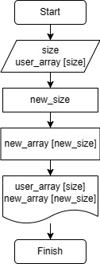
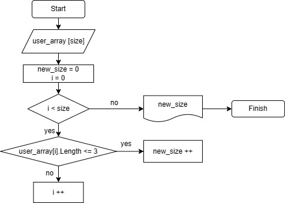
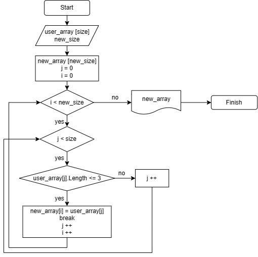
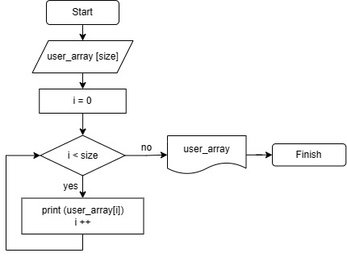

# Итоговая контрольная работа по основному блоку

## **Содержание**

* [задача](#задача);
* [алгоритм](#алгоритм);
* [блок-схемы](#блок-схемы).

## *Задача*
Написать программу, которая из имеющегося массива строк формирует новый массив из строк, длина которых меньше, либо равна 3 символам. Первоначальный массив можно ввести с клавиатуры, либо задать на старте выполнения алгоритма. При решении не рекомендуется пользоваться коллекциями, лучше обойтись исключительно массивами.

## *Алгоритм*
1. Создать исходный массив, запросив у пользователя его размер и значения элементов.
2. Определить размер нового массива из строк, длина которых меньше либо равна 3 символам:

    * ввести счетчик;
    * проверить длину каждого элемента исходного массива: если она меньше либо равна 3, то увеличить значение счетчика на 1;
    * вернуть значение счетчика.
3. Создать и заполнить новый массив размером из п.2 строками исходного массива, длина которых меньше либо равна 3 символам.
4. Вывести исходный массив.
5. Вывести новый массив.

## *Блок-схемы*
* Общий алгоритм

* Определение размера нового массива

* Заполнение нового массива

* Вывод массива

